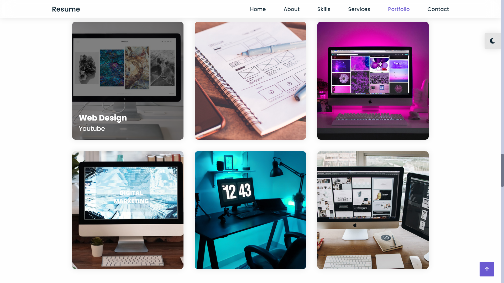

# 动态网页

#### 介绍
这是一个练习项目，通过纯HTML，CSS，JavaScript　编写的动态交互网页

#### 部分图示

#### 部分图示

#### 部分图示

#### 参与贡献

1.  该项目为仿照某大佬的网页，全程是自己参照编写
2.  项目加深前端三大基础知识，加强自己的动手能力
3.  代码通过Git提交

#### 特技

1.  使用 Readme\_XXX.md 来支持不同的语言，例如 Readme\_en.md, Readme\_zh.md
2.  Gitee 官方博客 [blog.gitee.com](https://blog.gitee.com)
3.  你可以 [https://gitee.com/explore](https://gitee.com/explore) 这个地址来了解 Gitee 上的优秀开源项目
4.  [GVP](https://gitee.com/gvp) 全称是 Gitee 最有价值开源项目，是综合评定出的优秀开源项目
5.  Gitee 官方提供的使用手册 [https://gitee.com/help](https://gitee.com/help)
6.  Gitee 封面人物是一档用来展示 Gitee 会员风采的栏目 [https://gitee.com/gitee-stars/](https://gitee.com/gitee-stars/)
